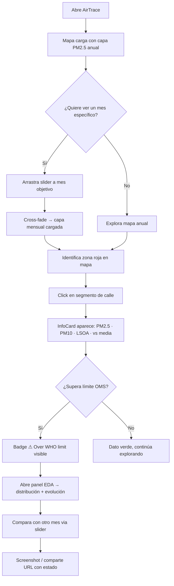
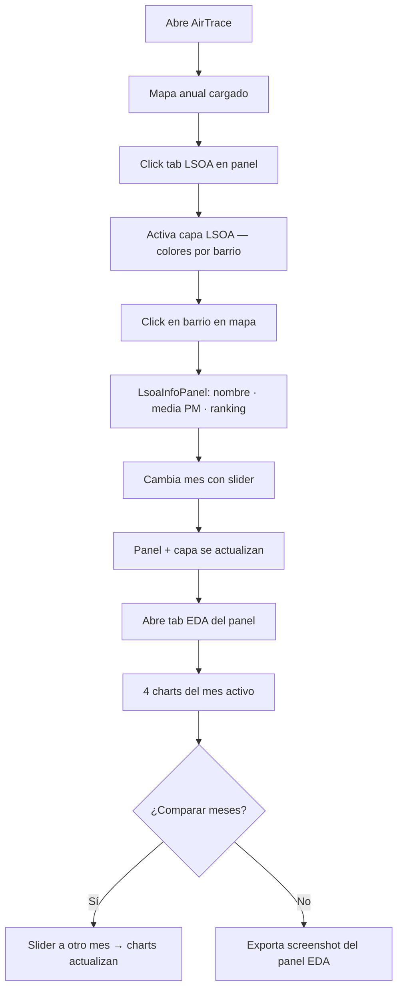

# UX Design Specification — AirTrace Web

**Author:** Boss  
**Date:** 2026-04-20

---

<!-- UX design content will be appended sequentially through collaborative workflow steps -->

## Core User Experience (Step 3)

### Defining Experience

El loop central de AirTrace: **mapa → slider → click → dato**. El usuario explora el mapa de contaminación, selecciona un mes con el slider, y hace click en un segmento para obtener datos precisos en la InfoCard.

### Platform Strategy

- **Desktop-first** — planificadores LCC trabajan en oficina con monitor
- **Responsive para tablet** — NHS analysts pueden trabajar en campo
- Web browser únicamente; sin app nativa

### Effortless Interactions

- Cambio de mes — animación fluida sin pantalla en blanco (cross-fade)
- Click en segmento → InfoCard aparece sin loading visible
- Primera carga — mapa visible antes de que carguen los datos mensuales

### Critical Success Moments

| Momento | Por qué importa |
|---------|----------------|
| Primer load: mapa visible en < 3s | Confianza inicial en la herramienta |
| Primera transición de mes: fluida | Define percepción de profesionalidad |
| Click en hotspot → datos claros | Momento de valor real para el Urban Planner |
| Panel EDA: 4 charts como narrativa coherente | Valida el trabajo del NHS Analyst |

### Experience Principles

1. **Mapa siempre visible** — nunca ocultado por paneles o modales
2. **Respuesta instantánea** — < 150ms en caché, feedback visual inmediato si no
3. **Claridad sobre densidad** — mostrar lo esencial; detalles bajo demanda
4. **Accesible por defecto** — WCAG AA es un requisito de diseño, no una capa posterior

---

## Responsive Design & Accessibility (Step 13)

### Responsive Strategy

| Breakpoint | Ancho | Comportamiento |
|-----------|-------|---------------|
| Desktop (primario) | ≥1024px | Layout D1 completo: mapa 65% + panel 340px |
| Tablet (secundario) | 768–1023px | Panel colapsable cerrado por defecto; InfoCard inferior |
| Mobile (no soportado) | <768px | Vista simplificada con aviso de experiencia limitada |

### Breakpoints Tailwind

`md:768px` → panel colapsable · `lg:1024px` → layout D1 · `xl:1280px` → panel expandible 400px

### Accessibility Strategy (WCAG 2.1 AA — obligatorio B2G)

| Criterio WCAG | Implementación |
|--------------|---------------|
| 1.4.3 Contraste texto (4.5:1) | Inter sobre `#0F1117` — verificado |
| 1.4.11 Contraste UI (3:1) | Borders `#2d3142` sobre `#1a1d27` — verificado |
| 2.1.1 Keyboard | shadcn/ui Tabs + Slider: ← → Tab Shift+Tab Esc |
| 2.4.7 Focus visible | `focus-visible:ring-2 ring-blue-500` en todos los interactivos |
| 4.1.3 Status messages | `aria-live="polite"` en InfoCard |
| 1.1.1 Non-text content | `aria-label` en mapa y badges de contaminación |
| 2.5.5 Touch targets | Mínimo 44×44px (`min-h-11` Tailwind) |
| 1.4.1 Color no único | Badges con icono ⚠ + texto además de color |

### Testing Strategy

- **Contraste**: Colour Contrast Analyser + Tailwind oklch checker
- **Keyboard**: navegación manual completa Tab / Enter / Esc / flechas
- **Screen reader**: NVDA + Chrome en Windows — verificar InfoCard y slider
- **Responsive**: DevTools breakpoints + tablet física si disponible
- **Daltonismo**: extensión Chrome Colorblinding — verificar paleta de contaminación

---

## UX Consistency Patterns (Step 12)

### Feedback Patterns

| Situación | Patrón visual |
|-----------|--------------|
| PM2.5 > 15 µg/m³ (límite OMS) | Badge `⚠ Over WHO limit` rojo en InfoCard |
| PM2.5 > 25 µg/m³ (límite UE) | Badge adicional `⚠ Exceeds EU limit` púrpura |
| GeoJSON cargando | Spinner inline en thumb del slider + mapa previo visible |
| Error de red | Toast `⚠ No se pudo cargar el mes. Reintentando…` |
| Segmento sin datos | InfoCard estado vacío: "Sin datos para este segmento" |

### Loading States

- **Carga inicial**: spinner centrado + skeleton del panel lateral
- **Transición de mes**: spinner 16px en slider thumb; fade-out del mapa previo solo cuando el nuevo está listo (ADR-001 opt.6)
- **Nunca**: pantalla completamente en blanco

### Navigation Patterns

- Tabs del panel: `border-bottom: 2px solid #3b82f6` (patrón shadcn/ui Radix)
- Layer switcher (PM2.5/PM10/LSOA): botones en topbar con estado `active`
- InfoCard: apertura al click en mapa, cierre con X o tecla Esc

### Empty States

- Panel EDA sin mes cargado: "Selecciona un mes para ver el análisis"
- LSOA sin barrio seleccionado: "Haz click en un barrio para ver sus estadísticas"

### Interaction Feedback

- Hover en segmento: `cursor: pointer` + highlight de calle (stroke más grueso)
- Hover en barrio LSOA: fill semitransparente
- Slider al arrastrar: tooltip nativo Radix con el mes activo sobre el thumb

---

## Component Strategy (Step 11)

### Design System Components (shadcn/ui)

| Componente | Uso |
|-----------|-----|
| `Slider` (Radix) | MonthSlider — 12 meses, ARIA completo |
| `Tabs` (Radix) | Panel lateral EDA / LSOA / Eventos |
| `Badge` | WHO limit warning, etiquetas contaminante |
| `Tooltip` | Valores en charts Recharts |
| `Separator` | Divisores en InfoCard y panel |

### Custom Components

**`PollutionMap`** — contenedor Mapbox GL JS
- `role="application"` · `aria-label="Mapa de contaminación de Liverpool"`

**`PollutionLayer`** — capa de calor Mapbox con expresión `match` sobre design tokens de color

**`InfoCard`** — flotante sobre el mapa al click
- Estados: oculto · loading · data · error
- Cierre con Esc (WCAG 2.1) · `role="complementary"` · `aria-live="polite"`

**`MonthSlider`** — wrapper shadcn Slider con etiquetas de mes
- `aria-valuetext="Junio 2024"` · spinner inline durante carga

**`LsoaLayer` + `LsoaInfoPanel`** — capa y detalle de barrio LSOA

**`EdaPanel`** — 4 charts Recharts (Histogram · TimeSeries · Scatter · TopLSOAs)

**`EventMarkers`** — markers Mapbox para eventos canónicos (F4, datos pendientes)

### Implementation Roadmap

| Fase | Componentes | Feature PRD |
|------|-------------|-------------|
| 1 | PollutionMap · PollutionLayer · InfoCard | F1, F6 |
| 2 | MonthSlider · prefetch + worker | F2 |
| 3 | EdaPanel + 4 charts | F3 |
| 4 | LsoaLayer · LsoaInfoPanel | F5 |
| 5 | EventMarkers | F4 (datos pendientes) |

---

## User Journey Flows (Step 10)

### FU-01 — Urban Planner: "Identificar hotspot y exportar insight"



### FU-02 — NHS Analyst: "Análisis estadístico por barrio LSOA"



### Journey Patterns

- **Entry → Map load**: único punto de entrada, sin onboarding ni splash screen
- **Slider → update**: mismo patrón para mapa + panel + InfoCard + LSOA (estado centralizado)
- **Click → detail**: click en entidad → detalle sin modal, en panel o InfoCard flotante
- **Error path**: si GeoJSON tarda → spinner en slider; mapa anterior permanece visible

### Flow Optimization Principles

1. Cero pasos hasta ver datos — el mapa con datos es el estado inicial
2. El slider es la única acción que actualiza todo simultáneamente
3. Click en mapa nunca navega a otra página — todo in-place
4. Recuperación de error: nunca pantalla en blanco, siempre estado anterior visible

---

## Design Direction Decision (Step 9)

### Design Directions Explored

6 direcciones evaluadas: D1 Dark Split · D2 Light Professional · D3 Full-bleed Map · D4 EDA Focus · D5 Compact Dark · D6 Horizontal Split. Mockups interactivos en `ux-design-directions.html`.

### Chosen Direction

**D1 — Dark Split**

- Panel lateral derecho fijo con tabs (EDA · LSOA · Eventos)
- Mapa principal ~65% viewport con capa de contaminación coloreada
- Barra de slider fija en la parte inferior del mapa
- InfoCard flotante sobre el mapa, anclada al punto de click
- Topbar con logo + controles de capa (PM2.5 / PM10 / LSOA)

### Design Rationale

- Mejor balance entre visualización del mapa y datos contextuales
- Panel lateral no compite con el mapa — el mapa siempre domina
- Slider en barra inferior: intuitivo, siempre accesible, no ocupa espacio del mapa
- InfoCard flotante: aparece donde el usuario está mirando (cerca del click)
- Modo oscuro: el mapa Mapbox se ve significativamente mejor sobre fondo oscuro

### Implementation Approach

Layout con CSS Grid/Flexbox: `[mapa 1fr] [panel 340px]`. Slider como componente fijo en el DOM (no absoluto). InfoCard con posicionamiento absoluto sobre el mapa. Panel con tabs usando shadcn/ui Tabs + Radix UI.

---

## Visual Design Foundation (Step 8)

### Color System

**Paleta UI (modo oscuro — mapa se ve mejor sobre fondo oscuro):**
```
Background:   #0F1117
Surface:      #1A1D27  (cards, paneles)
Border:       #2D3142
Text primary: #F0F2F7
Text muted:   #8B92A9
```

**Design tokens de contaminación:**
```
--pm-safe:      #22C55E   (PM2.5 < 10 µg/m³)
--pm-low:       #EAB308   (10–15)
--pm-medium:    #F97316   (15–25)
--pm-high:      #EF4444   (25–35)
--pm-critical:  #7C3AED   (> 35)
```
Escala YlOrRd adaptada — perceptualmente uniforme, accesible para daltonismo (forma/icono como segunda señal).

**Accent:** `#3B82F6` (azul — botones, slider activo, links)

### Typography System

- **Inter** variable font — excelente legibilidad para datos numéricos en dashboards
- Escala: xs(10px) · sm(12px) · base(14px) · lg(16px) · 2xl(20px)
- Datos numéricos: `font-mono` (tabular numbers para alineación)

### Spacing & Layout Foundation

- Base unit: **4px** (Tailwind default)
- Dashboard split: mapa **65%** | panel lateral **35%** (colapsable)
- Slider: barra fija bottom del mapa, altura 48px
- InfoCard: flotante sobre mapa, ancho 280px, aparece junto al punto de click

### Accessibility Considerations

- Ratio de contraste mínimo 4.5:1 para texto (WCAG AA)
- Paleta de contaminación con forma/icono como segunda señal (no solo color)
- shadcn/ui + Radix UI: ARIA completo en todos los componentes interactivos
- Tamaño mínimo de target táctil: 44×44px (WCAG 2.5.5)

---

## Core User Experience — Defining Experience (Step 7)

### Defining Experience

> **"Ver la contaminación en tu barrio y entender por qué"**

AirTrace: mapa de Liverpool coloreado → slider de mes → click en segmento → InfoCard con datos de contaminación + contexto.

### User Mental Model

"Es como Google Maps pero para ver la calidad del aire" — patrón completamente establecido, sin curva de aprendizaje. Los usuarios traen el modelo mental de mapas interactivos con click-to-info.

### Success Criteria

- Mapa visible y coloreado en < 3s desde primera carga
- Cambio de mes: cross-fade fluido sin pantalla en blanco
- Click en segmento → InfoCard aparece < 100ms
- Badge "⚠ Over WHO limit" cuando PM2.5 > 15 µg/m³ (límite OMS 2021)

### Novel UX Patterns

Ninguno — 100% patrones establecidos. Mapa interactivo + click + panel lateral. Ventaja: cero coste de aprendizaje para el usuario.

### Experience Mechanics

| Fase | Acción usuario | Respuesta sistema |
|------|---------------|------------------|
| Iniciación | Abre la app | Mapa Liverpool con capa PM2.5 anual, paleta verde→rojo |
| Exploración | Mueve slider de mes | Cross-fade de capa, etiqueta de mes actualizada |
| Selección | Click en segmento | InfoCard anclada: PM2.5, PM10, calle, LSOA, vs. media |
| Contexto | Abre panel EDA | 4 charts del mes activo en panel lateral colapsable |
| Cierre | Click fuera o X | InfoCard desaparece, mapa listo para nueva selección |

---

## Design System Foundation (Step 6)

### Design System Choice

**shadcn/ui + Tailwind CSS v4**

### Rationale for Selection

- Componentes copiados al proyecto (sin dependencia runtime de npm)
- Radix UI como base garantiza WCAG AA en todos los componentes interactivos (Slider, Tooltip, Dialog)
- Slider de meses, InfoCard y panel EDA se benefician de primitivos accesibles ya construidos
- Compatible con React 19 + Vite 6 sin configuración adicional

### Implementation Approach

- Instalar shadcn/ui CLI y copiar solo los componentes necesarios
- Base: Slider, Tooltip, Card, Badge, Separator
- Tipografía: Inter (legibilidad de datos numéricos)

### Customization Strategy

- Design tokens como CSS custom properties: paleta de contaminación (verde→amarillo→rojo), colores UI neutros
- Tailwind `theme.extend` para tokens de contaminación: `--pm-low`, `--pm-medium`, `--pm-high`, `--pm-critical`
- Modo oscuro opcional (mapa Mapbox se ve mejor sobre fondo oscuro)

---

## UX Pattern Analysis & Inspiration (Step 5)

### Inspiring Products Analysis

| Producto | Relevancia | Patrón clave |
|----------|-----------|--------------|
| **Kepler.gl** (Uber) | Dashboard GIS de datos urbanos, audiencia similar | Panel lateral colapsable, slider temporal, capas jerárquicas |
| **Google Maps** | Mapa como superficie principal, InfoCard al click | InfoCard anclada al punto de click con cierre explícito |
| **Observable / Flourish** | Dataviz para audiencias no técnicas | Charts como narrativa, tooltips contextuales |
| **UK Gov Design System** | Estándar visual B2G del gobierno británico | Tipografía, color, WCAG AA como base |

### Transferable UX Patterns

- **Panel lateral colapsable** (Kepler.gl) → F3 EDA sin tapar el mapa
- **InfoCard anclada al punto** (Google Maps) → F6, con cierre explícito
- **Leyenda flotante sobre el mapa** (Kepler.gl) → F1, no en panel separado
- **Gov UK Design System**: alto contraste, tipografía legible → base WCAG AA

### Anti-Patterns to Avoid

- Modales que bloquean el mapa — el mapa siempre visible de fondo
- Tooltips con exceso de datos — máximo 3-4 valores en InfoCard primer nivel
- Paleta jet/arco iris — usar escala perceptualmente uniforme (YlOrRd o viridis)
- Controles flotantes sin anchoring — el slider debe estar fijo en el layout

### Design Inspiration Strategy

**Adoptar:** panel lateral colapsable de Kepler.gl + InfoCard de Google Maps  
**Adaptar:** color system del Gov UK DS para cumplir WCAG AA con paleta de contaminación  
**Evitar:** modales de bloqueo, exceso de información en tooltips, colormaps no accesibles

---

## Desired Emotional Response (Step 4)

### Primary Emotional Goals

**Emoción primaria: Confianza + Competencia profesional.**
El usuario debe sentir que tiene datos fiables y que la herramienta le hace parecer informado. AirTrace es una herramienta profesional B2G, no una app de consumo.

### Emotional Journey Mapping

| Momento | Emoción objetivo | Emoción a evitar |
|---------|-----------------|-----------------|
| Primera carga | Impresionado ("esto se ve serio") | Confusión ("¿qué hago aquí?") |
| Explorando el mapa | Curiosidad + control | Overwhelm por exceso de información |
| Cambio de mes | Fluidez ("qué suave") | Ansiedad por espera |
| Click en hotspot | Satisfacción ("exacto lo que necesitaba") | Frustración por datos poco claros |
| Panel EDA | Comprensión ("entiendo el patrón") | Pérdida ("no sé qué me dice esto") |
| Compartir resultados | Orgullo profesional | Vergüenza por herramienta poco pulida |

### Design Implications

- **Confianza** → tipografía clara, datos con unidades explícitas, sin ambigüedad
- **Control** → slider y filtros siempre visibles, sin estados ocultos
- **Fluidez** → transiciones suaves, sin janks, sin loaders innecesarios
- **Profesionalidad** → paleta contenida, densidad de información moderada

### Emotional Design Principles

1. Cada dato mostrado debe tener contexto (unidades, escala, fuente)
2. Los estados de carga deben ser cortos y visualmente discretos
3. Los errores deben explicarse, nunca ocultarse
4. La herramienta debe sentirse más rápida de lo esperado

---

## Executive Summary

### Project Vision

AirTrace es un dashboard web B2G que visualiza predicciones de contaminación del aire (PM2.5/PM10) en Liverpool a nivel de calle (8,450 segmentos) y barrio (302 LSOAs). Basado en un modelo LUR/SVR validado sobre 21 sensores IoT, sirve como herramienta de apoyo a decisiones de política urbana y análisis de salud pública para Liverpool City Council y el NHS.

### Target Users

**FU-01 — Urban Planner (Liverpool City Council)**
Analiza zonas de alta contaminación para decisiones de política urbana. Flujo principal: explorar mapa → cambiar mes con slider → identificar hotspots → consultar InfoCard de segmento → comparar con vista LSOA por barrio.

**FU-02 — NHS Health Analyst**
Correlaciona datos de contaminación con indicadores de salud por barrio. Flujo principal: panel EDA → vista LSOA → filtro mensual → exportar insights narrativos.

### Key Design Challenges

1. **Cohabitación mapa + panel EDA** — el dashboard concentra mucha información; el layout debe jerarquizar sin abrumar al usuario
2. **InfoCard flotante sobre mapa** — posicionamiento dinámico que no occulte datos relevantes del segmento seleccionado
3. **Accesibilidad WCAG 2.1 AA en mapa interactivo** — navegación por teclado y compatibilidad con screen readers en Mapbox GL JS
4. **Slider mensual sin jank percibido** — feedback visual inmediato durante la transición de capas (< 150 ms en caché)

### Design Opportunities

1. **Cross-fade de capas** — la transición suave entre meses (ADR-001 opt.6) puede sentirse premium si se refuerza con diseño visual
2. **Escala de color intuitiva PM2.5** — paleta verde→amarillo→rojo con leyenda clara genera impacto inmediato y es universalmente comprensible
3. **Panel EDA como narrativa de datos** — la progresión de los 4 charts puede contar una historia coherente sobre la calidad del aire en Liverpool
